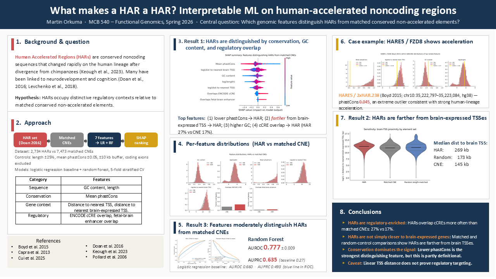

# HAR Comparative Genomics

**Do Human Accelerated Regions (HARs) occupy genomic neighborhoods that differ from matched conserved non-accelerated elements (CNEs)? An interpretable machine-learning analysis.**



> *Click for full resolution. PDF version: [docs/HAR_Genomic_poster.pdf](docs/Orkuma_HAR_comp_genomics_poster.pdf)*

---

## Overview

This repository compares Human Accelerated Regions (HARs) with length- and conservation-matched conserved non-accelerated elements (CNEs) using a small set of genomic and regulatory features. 
The analysis uses interpretable classification models to identify which features best distinguish HARs from matched controls and examines the result at the **HARE5 / FZD8** locus.

The workflow is designed to answer one central question: **which genomic features most clearly separate HARs from matched conserved elements?**

## Manual data step (before running pipeline)

Cell Press blocks automated downloads of supplemental files. Before running the
pipeline, manually download Doan et al. (2016) **Table S1** (the 1.39 MB
spreadsheet, "Combined HARs from Five Previous Studies") from:

  https://www.cell.com/cell/fulltext/S0092-8674(16)31169-2

Save it to `data/raw/doan2016_hars.xlsx`. The pipeline will skip the download
attempt if the file is already present.

## Run the Pipeline

```bash
bash setup.sh                                       # one-time: conda env + tool checks
conda activate har-ml                               # activate conda virtual environ
bash scripts/run_all.sh                             # end-to-end pipeline 
python scripts/05_sensitivity_brain_tss.py          # runs sensitivity check
```

### Stages of the Pipeline

| Stage | Script | What it does | Key output |
|---|---|---|---|
| 1 | `01_acquire.sh` | Downloads HARs, phastCons CNEs, ENCODE cCREs, GENCODE, and GTEx brain expression data. Lifts HAR coordinates to hg38 if needed. | `data/raw/`, `data/processed/hars.hg38.bed`, `data/processed/cnes.hg38.bed` |
| 2 | `02_build_features.py` | Builds a feature table for HARs and CNEs. | `data/processed/features.tsv` |
| 3 | `03_classify.py` | Trains logistic regression and random forest models with stratified 5-fold cross-validation. | `outputs/tables/cv_metrics.tsv`, `outputs/models/rf.pkl`, ROC figure |
| 4 | `04_interpret.py` | Computes SHAP values for the random forest and generates the HARE5 case-study figure. | `outputs/figures/shap_summary.png`, `outputs/figures/hare5_case_study.png` |
| 5* | `05_sensitivity_brain_tss.py` | Sensitivity check: compares distance-to-nearest-brain-TSS for HARs, matched CNEs, and random length-matched intervals. Tests whether the reversed HAR-vs-CNE proximity is a conservation-matching artifact. | `outputs/figures/sensitivity_brain_tss.png`, `outputs/tables/sensitivity_brain_tss.tsv` |

\* Stage 5 is a follow-up analysis and is not run by `scripts/run_all.sh`. After the main pipeline finishes, run it with `python scripts/05_sensitivity_brain_tss.py`.


## Features 

The analysis uses seven features for each genomic element:

| # | Feature | Hypothesis if HAR-distinguishing |
|---|---|---|
| 1 | GC content | Tests whether HARs differ in sequence composition. |
| 2 | Element length | Included as a control after matching. |
| 3 | phastCons 100-way score | Captures deep conservation prior to human-lineage acceleration. |
| 4 | Distance to nearest TSS | Measures proximity to annotated genes. |
| 5 | Distance to nearest brain-expressed TSS | Tests whether HARs are preferentially located near brain-relevant genes. |
| 6 | Overlap with ENCODE cCRE | Measures overlap with annotated regulatory elements. |
| 7 | Overlap with fetal-brain-active enhancer | Provides a more specific developmental regulatory annotation. |

## The concrete example: HARE5 → FZD8

`04_interpret.py` generates a case-study panel for HARE5 (2xHAR.238), the enhancer linked to altered FZD8 expression in developing cortex in Boyd et al. (2015). This figure places HARE5 within the full HAR and CNE feature distributions and provides a concrete example alongside the global SHAP summary.

If another HAR better reflects the top-ranked feature in the final analysis, the case study can be changed by editing CASE_STUDY_HAR in config.yaml.

## Repository layout

```
har-comparative-genomics/
├── README.md
├── setup.sh                         # one-time env setup
├── environment.yml                  # conda
├── requirements.txt                 # pip extras
├── config.yaml                      # all paths, URLs, parameters
├── .gitignore
├── scripts/
│   ├── 01_acquire.sh                # data download + liftOver + matched CNE construction
│   ├── 02_build_features.py         # feature engineering
│   ├── 03_classify.py               # LR + RF + 5-fold CV
│   ├── 04_interpret.py              # SHAP + HARE5 case study
│   ├── 05_sensitivity_brain_tss.py  # follow-up: brain-TSS proximity sanity check
│   └── run_all.sh                   # orchestrator
├── data/
│   ├── raw/                         # downloaded files (gitignored)
│   └── processed/                   # derived (gitignored)
├── outputs/
│   ├── figures/                     # poster figures
│   ├── tables/                      # poster tables
│   └── models/                      # trained classifiers
├── logs/                            # per-stage logs (gitignored)
└── docs/
    ├── poster_outline.md            # poster panel-by-panel
    ├── talk_outline.md              # 10-min talk slide-by-slide
    └── paper_outline.md             # written paper structure
```

## Outputs

Primary outputs include:
- Feature table for HARs and matched CNEs
- Cross-validation performance summaries
- Trained random forest model
- ROC figure
- SHAP summary plot
- HARE5 case-study figure

## References

- Boyd, J. L. et al. (2015). Human-chimpanzee differences in a FZD8 enhancer alter cell-cycle dynamics in the developing neocortex. *Current Biology* 25:772–779.
- Capra, J. A., Erwin, G. D., McKinsey, G., Rubenstein, J. L. R., & Pollard, K. S. (2013). Many human accelerated regions are developmental enhancers. *Phil. Trans. R. Soc. B* 368:20130025.
- Doan, R. N. et al. (2016). Mutations in human accelerated regions disrupt cognition and social behavior. *Cell* 167:341–354.
- Keough, K. C. et al. (2023). Three-dimensional genome rewiring in loci with human accelerated regions. *Science* 380:eabm1696.
- Pollard, K. S. et al. (2006). An RNA gene expressed during cortical development evolved rapidly in humans. *Nature* 443:167–172.
